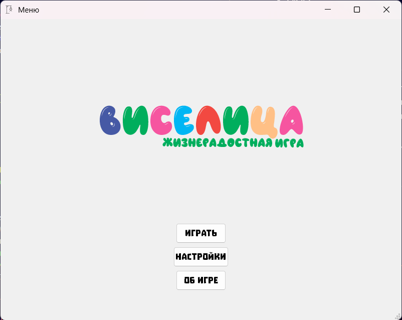
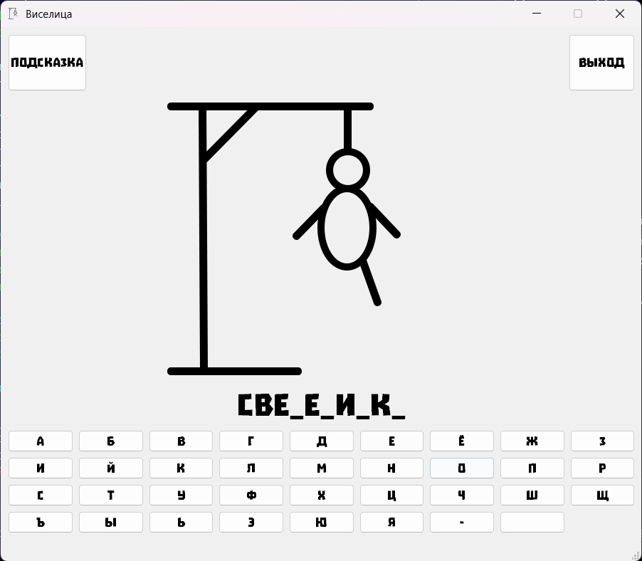
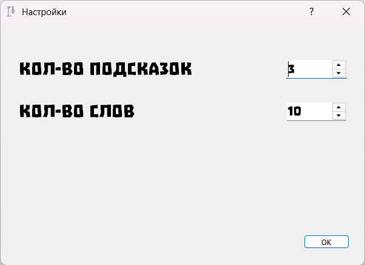

# Виселица

Классическая игра, в которой вам нужно угадать загаданное слово, отгадывая по одной букве за раз. Если вы сделаете 11 неправильных попыток, то составленная вами часть виселицы будет завершена, и игра будет проиграна. Ваша задача - отгадать слово до того, как виселица будет завершена.

## Содержание
- [Содержание](#содержание)
- [Правила](#правила-игры)
- [Установка](#установка-и-запуск)
- [Зависимости](#зависимости)
- [Структура](#структура-проекта)
- [Скриншоты](#структура-проекта)

## Правила игры
1. Нажмите "Играть", чтобы начать игру.
2. Вводите буквы с помощью виртуальной клавиатуры на экране.
3. Если буква присутствует в загаданном слове, она откроется в соответствующих позициях.
4. Если буква отсутствует, будет добавлена часть виселицы.
5. У вас есть максимум 11 попыток, чтобы угадать слово.
6. Игра заканчивается, если вы угадаете слово или сделаете 11 неправильных попыток.

Удачи в игре!

## Установка и запуск
1. Убедитесь, что у вас установлен Python 3.9 или выше.
2. Установите зависимости с помощью команды:
   ```bash
   pip install -r requirements.txt
   ```
3. Запустите проект командой:
   ```bash
   python main.py
   ```

## Технологии
- PyQt5
- SQLite
- Python 3.9+

## Структура проекта
- `main.py`: Основной файл для запуска приложения.
- `ui-files/`: Папка с файлами интерфейса.
- `pict/`: Папка с изображениями для игры (элементы виселицы, экран победы/проигрыша).
- `abc.sqlite`: База данных с доступными словами.

## Скриншоты



